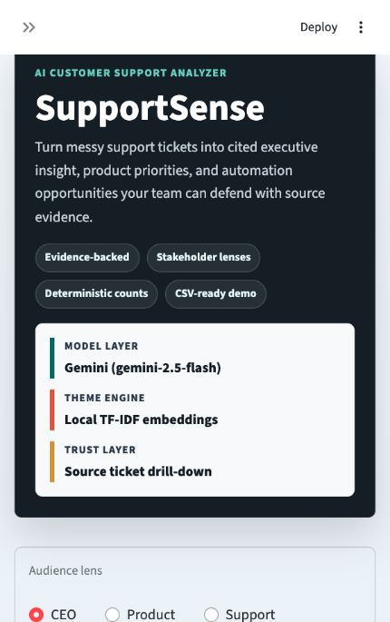

# SupportSense

SupportSense is an AI customer support analyzer for mid-size SaaS companies. It turns a CSV of support tickets into executive summaries, top customer pain themes, bot-solvable opportunities, product recommendations, and trusted follow-up answers.

The production track now extends that analyzer into a tenant-isolated platform
demonstrating **AI Agent + Agent Assist + Conversation Intelligence**. It adds a
versioned FastAPI service, PostgreSQL schema and migrations, multi-turn memory,
LangGraph orchestration, typed support tools, supervisor approvals, hybrid
retrieval with tenant-isolated Chroma indexing, guardrails, audit history,
evaluations, metrics, and AWS deployment infrastructure.



## Business Problem

Support leaders have thousands of tickets, but leadership wants answers in minutes:

- What are customers frustrated about?
- Which issues are growing?
- Which cases can a bot solve?
- What should product fix next?

SupportSense compresses an analyst workflow into a fast, demo-friendly AI workflow.

## Demo Flow

1. Upload a support ticket CSV or use the bundled sample dataset.
2. Review executive KPIs and five cited insights.
3. Inspect top issue themes, trends, and example tickets.
4. See bot-solvable vs human-required ticket categories.
5. Switch between CEO, Product, and Support lenses to reframe the same evidence for different stakeholders.
6. Ask follow-up questions like "show me angry enterprise customers" or "how many billing tickets are high priority".

## Original analyzer architecture

```text
CSV Upload -> Streamlit UI -> Analytics Layer
                         -> Theme Discovery
                         -> Executive Summary
                         -> Product Recommendations
                         -> Ticket Chat
```

The original analyzer remains available as a fast CSV demo. The production
track adds a separate role-aware support console, FastAPI service, PostgreSQL,
Redis, ChromaDB, tool gateway, approval workflows, and AWS deployment.

For the implemented production architecture, request flow, database schema,
security model, and failure behavior, see
[docs/PRODUCTION_ARCHITECTURE.md](docs/PRODUCTION_ARCHITECTURE.md).

## AI Design Choices

- Embeddings first, LLM second: discover ticket groups from the data, then use AI to explain them.
- Deterministic counts: the app computes numbers directly instead of asking a model to guess.
- Citations by default: claims include ticket IDs so a skeptical stakeholder can inspect the source.
- Evidence drill-down: executive insights, recommendations, themes, and chat answers can open the source ticket rows.
- Audience lens: the same dataset can be packaged for CEO, Product, or Support conversations.
- Human-in-the-loop framing: automation is recommended for repetitive cases, not for bugs, renewals, or roadmap decisions.

## Run Locally

```bash
python3 -m venv .venv
source .venv/bin/activate
pip install -r requirements.txt
python scripts/generate_sample_data.py
streamlit run app/streamlit_app.py
```

Optional:

```bash
cp .env.example .env
```

Then add a model API key for AI-powered executive summaries. For free testing, Gemini is the easiest path:

```bash
AI_PROVIDER=gemini
GEMINI_API_KEY=your_gemini_key_here
GEMINI_MODEL=gemini-2.5-flash
THEME_EMBEDDING_PROVIDER=local
```

You can also use `AI_PROVIDER=anthropic` with `ANTHROPIC_API_KEY`, or leave keys blank to use the local deterministic fallback. For semantic theme clustering with Gemini, set `THEME_EMBEDDING_PROVIDER=gemini`. Use synthetic or approved data when sending tickets to an external model provider.

Run lint, tests, and release evaluations:

```bash
pip install --require-hashes -r requirements-dev.lock
ruff check .
pytest -q
python scripts/run_production_evals.py
```

Run the production API:

```bash
pip install --require-hashes -r requirements-production.lock
alembic upgrade head
uvicorn supportsense.api:app --reload
```

Development authentication uses `Authorization: Bearer dev-admin-key`.
Production disables that default and expects configured API keys or verified
OIDC/JWT claims. OpenAPI documentation is available at
`http://localhost:8000/docs`.

Run production release gates:

```bash
python scripts/run_production_evals.py
python scripts/verify_roadmap.py
```

Build the reproducible 40-second walkthrough from real local API responses
(requires `ffmpeg`):

```bash
python scripts/build_demo_video.py
```

Generated artifact:
[SupportSense production demo](outputs/supportsense-production-demo.mp4).

Run the complete role-aware support console:

```bash
streamlit run app/support_console.py
```

Or start API, console, PostgreSQL, Redis, ChromaDB, Prometheus, and Grafana:

```bash
docker compose up --build
```

The Compose stack uses the HTTP-only Chroma client `1.5.9` and an
OCI-digest-pinned pure-Rust Chroma server built from the corresponding release
commit; it does not install the vulnerable full Python server distribution.
`SUPPORTSENSE_EMBEDDING_PROVIDER=local` is deterministic and provider-free;
set it to `gemini` or `openai` with the corresponding API key for semantic
production embeddings.

Production documentation:

- [Product requirements](docs/PRODUCT_REQUIREMENTS.md)
- [Architecture and request flow](docs/PRODUCTION_ARCHITECTURE.md)
- [Staged rollout](docs/STAGED_ROLLOUT.md)
- [API contracts](docs/API_CONTRACTS.md)
- [Evaluation report](docs/EVALUATION_REPORT.md)
- [Deployment guide](docs/DEPLOYMENT.md)
- [Production readiness checklist](docs/PRODUCTION_READINESS_CHECKLIST.md)
- [Roadmap traceability and external gates](docs/ROADMAP_TRACEABILITY.md)
- [Demo runbook and recording script](docs/DEMO_RUNBOOK.md)
- [AWS deployment](infra/terraform/README.md)

## CSV Format

Recommended columns:

- `ticket_id`
- `created_at`
- `customer_name`
- `customer_segment`
- `plan_type`
- `priority`
- `status`
- `subject`
- `description`
- `csat_score`

The bundled `data/sample_tickets.csv` shows the full recommended schema. The importer also understands common support-export columns such as `Ticket ID`, `Customer Name`, `Ticket Type`, `Ticket Subject`, `Ticket Description`, `Ticket Priority`, `Ticket Status`, `Product Purchased`, `First Response Time`, `Time to Resolution`, and `Customer Satisfaction Rating`.

## Evaluation

The production release suite contains 140 cases covering intent, retrieval,
citations, response correctness, tool selection and parameters, prompt
injection, PII, hallucination controls, escalation precision/recall, latency,
and cost. CI regenerates the report and blocks releases on any failed gate.
