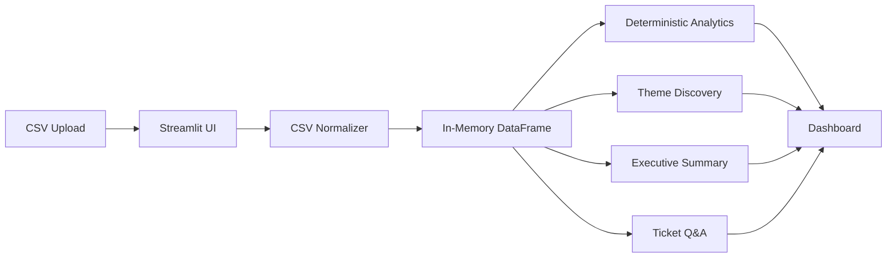
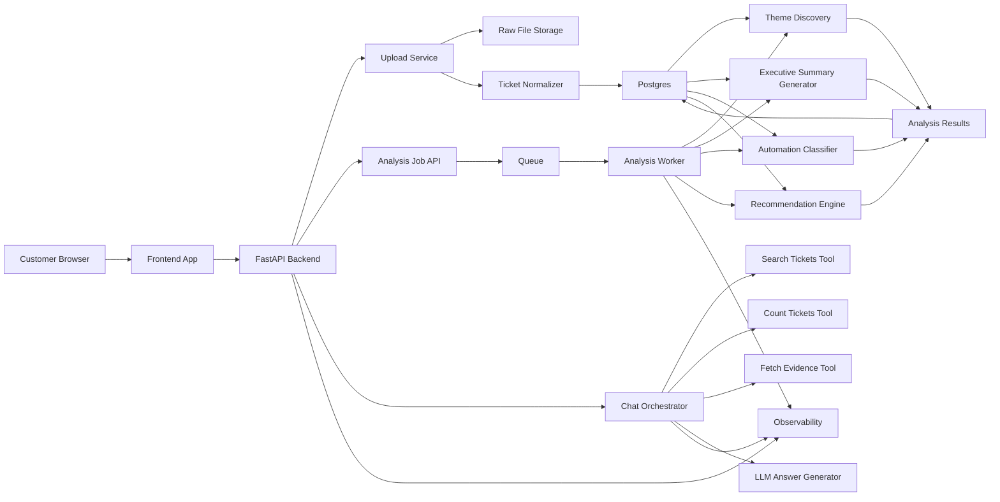
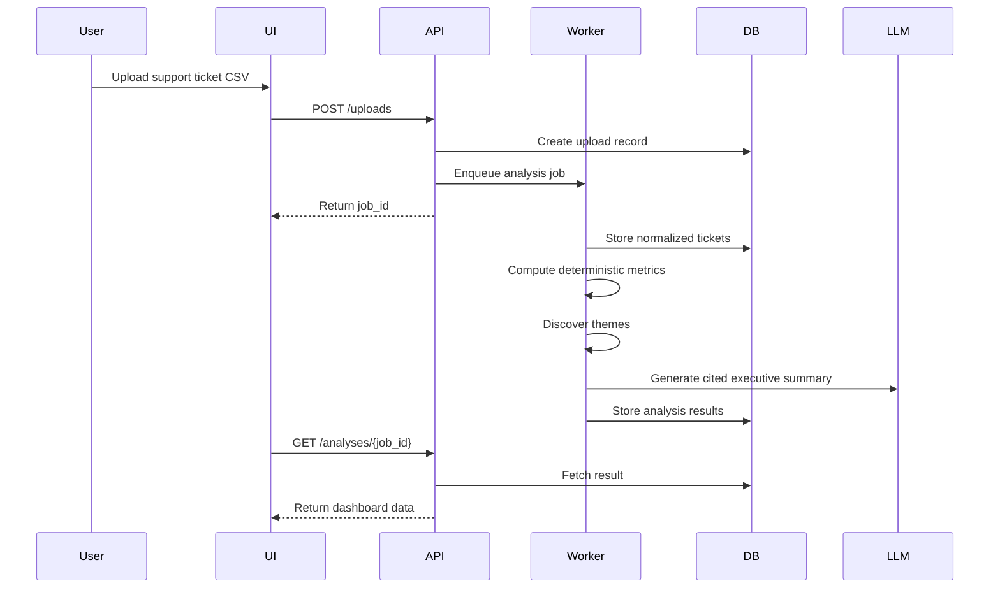
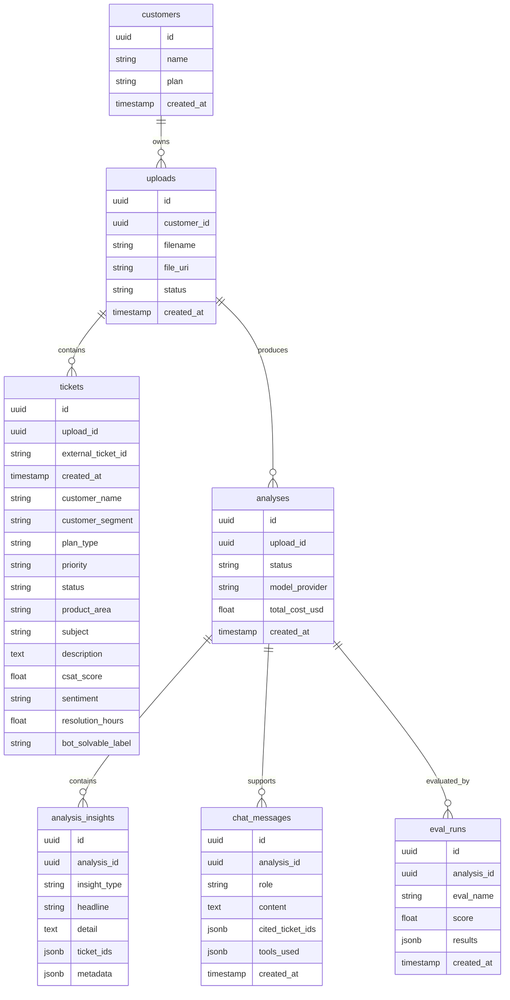
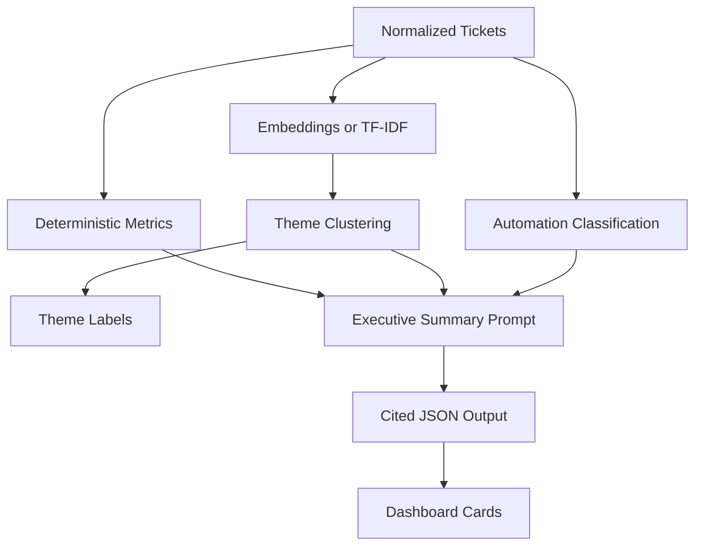

# SupportSense System Design

SupportSense is an AI customer support analyzer for SaaS teams. The demo runs as a Streamlit app, but the product is designed as a production system that separates upload handling, ticket analysis, AI generation, chat tools, evaluations, and observability.

## 1. Product Goal

Support teams already have the raw data: tickets, comments, priorities, CSAT, channels, and resolution history. The hard part is turning that data into leadership-ready answers quickly.

SupportSense helps a support leader answer:

- What are customers frustrated about?
- Which issues are growing?
- Which issues are high severity?
- Which tickets are bot-solvable?
- What should product fix next?
- Which source tickets prove each claim?

The business outcome is to reduce a weekly analyst workflow into a 10 minute AI-assisted review while keeping every insight traceable to source tickets.

## 2. Current Demo Architecture



The current version is intentionally simple:

- Streamlit handles upload, filters, dashboard, and chat.
- Pandas handles cleaning, filtering, counts, and metrics.
- Local TF-IDF or Gemini embeddings support theme discovery.
- Gemini, Claude, or a local fallback can generate executive summaries.
- Chat uses deterministic filters and counts instead of asking the model to invent numbers.

This keeps the demo fast and easy to run while still demonstrating the core AI solution design.

## 3. Production Target Architecture



Production components:

- Frontend: Streamlit for demo, React or Next.js for production.
- Backend: FastAPI for upload, analysis, chat, and result APIs.
- Database: Postgres for customers, uploads, tickets, analyses, chat messages, and eval results.
- File storage: S3, GCS, or Azure Blob for raw uploaded CSVs.
- Worker: Celery, RQ, or a managed queue worker for async analysis jobs.
- Queue: Redis, SQS, Pub/Sub, or Cloud Tasks.
- LLM providers: Gemini, Claude, or OpenAI through a provider abstraction.
- Observability: LangSmith, structured logs, token usage, latency, and cost tracking.

## 4. Data Flow



Key principle: deterministic computation owns numbers, counts, filters, and source evidence. The LLM owns summarization, explanation, and business framing.

## 5. Core Services

### Upload Service

Responsibilities:

- Accept CSV uploads.
- Validate file type and size.
- Store the raw file.
- Create an upload record.
- Start an analysis job.

Failure handling:

- Reject unsupported files.
- Return clear missing-column or schema-mapping errors.
- Keep the raw file for debugging if the user allows it.

### Ticket Normalizer

Responsibilities:

- Map common export columns into the SupportSense schema.
- Clean placeholder text.
- Parse dates.
- Normalize priorities and statuses.
- Derive missing fields such as customer segment, sentiment, and bot-solvable label when possible.

Example column mappings:

| Uploaded column | Internal field |
| --- | --- |
| `Ticket ID` | `ticket_id` |
| `Customer Name` | `customer_name` |
| `Ticket Type` | `plan_type` or issue category |
| `Ticket Subject` | `subject` |
| `Ticket Description` | `description` |
| `Ticket Priority` | `priority` |
| `Ticket Status` | `status` |
| `Product Purchased` | `product_area` |
| `Customer Satisfaction Rating` | `csat_score` |

### Analysis Worker

Responsibilities:

- Compute KPIs.
- Discover themes.
- Classify automation potential.
- Generate executive summary.
- Generate product recommendations.
- Store reusable results.

The worker runs outside the request path so large files do not freeze the UI.

### Chat Orchestrator

Responsibilities:

- Parse the user's question.
- Select the right tool.
- Return answers grounded in the ticket corpus.
- Cite ticket IDs.
- Avoid invented counts.

Recommended chat tools:

| Tool | Purpose |
| --- | --- |
| `search_tickets(query, filters)` | Find relevant ticket examples. |
| `count_tickets(filters)` | Return exact counts for business questions. |
| `get_ticket(ticket_id)` | Fetch a source ticket for citation. |
| `summarize_evidence(ticket_ids)` | Summarize a small evidence set. |

The important design choice is that counts come from code, not from the LLM.

## 6. API Design

Suggested backend endpoints:

| Method | Endpoint | Purpose |
| --- | --- | --- |
| `POST` | `/uploads` | Upload a CSV and create an analysis job. |
| `GET` | `/uploads/{upload_id}` | Get upload status and metadata. |
| `GET` | `/analyses/{analysis_id}` | Fetch dashboard results. |
| `POST` | `/analyses/{analysis_id}/refresh` | Re-run analysis after prompt or config changes. |
| `POST` | `/chat` | Ask follow-up questions about a dataset. |
| `GET` | `/tickets/{ticket_id}` | Fetch one source ticket. |
| `GET` | `/evals/{analysis_id}` | Fetch evaluation results. |

Example `POST /chat` request:

```json
{
  "analysis_id": "analysis_123",
  "question": "How many high priority billing tickets came from enterprise customers?"
}
```

Example response:

```json
{
  "answer": "There are 42 high priority billing tickets from enterprise customers.",
  "citations": ["TCK-102", "TCK-118", "TCK-145"],
  "tools_used": ["count_tickets", "search_tickets"],
  "confidence": "high"
}
```

## 7. Database Schema

Suggested relational schema:



## 8. AI Pipeline



AI should be used selectively:

- Use code for totals, percentages, dates, filters, and counts.
- Use embeddings for grouping semantically similar tickets.
- Use the LLM for naming themes, explaining business impact, and writing executive summaries.
- Require ticket IDs for every generated claim.

This is the main trust strategy.

## 9. Prompting Strategy

Prompts should request structured JSON instead of free-form prose.

Executive summary output shape:

```json
{
  "headline": "string",
  "detail": "string",
  "business_impact": "string",
  "ticket_ids": ["TCK-123", "TCK-456"]
}
```

Rules for the model:

- Use only provided metrics and tickets.
- Do not invent counts.
- Cite ticket IDs for every claim.
- Say when the data is insufficient.
- Prefer plain business language over technical language.

## 10. Evaluation Plan

The eval suite should test business reliability, not only model fluency.

Recommended eval categories:

| Eval | What it checks |
| --- | --- |
| Count correctness | Numeric answers match deterministic filters. |
| Citation validity | Cited ticket IDs exist and support the claim. |
| Theme quality | Human-labeled tickets match detected themes. |
| Refusal behavior | The system says it does not know when data is missing. |
| Executive usefulness | Summary is concise, relevant, and decision-oriented. |
| Cost and latency | Analysis stays within target budget and time. |

Production eval workflow:

1. Maintain a golden dataset with human-labeled tickets.
2. Run evals on every prompt or model change.
3. Track regressions by category.
4. Store eval runs in the database.
5. Review failures weekly with product and support stakeholders.

## 11. Observability

Track each analysis and chat turn:

- Upload size and row count.
- Normalization warnings.
- Analysis duration.
- LLM provider and model.
- Prompt and completion token counts.
- Estimated cost.
- Tool calls used by chat.
- Citation coverage.
- Error rate by pipeline step.

Suggested tools:

- LangSmith for LLM traces.
- Structured application logs for backend events.
- Postgres tables for analysis history and eval results.
- Dashboard metrics for latency, cost, and failure rate.

## 12. Security and Privacy

Enterprise AI buyers will care about data handling.

Required controls:

- Store API keys in environment variables or a secrets manager.
- Never commit `.env` files.
- Redact or hash customer emails before sending data to an LLM.
- Keep each customer's uploads isolated by tenant ID.
- Log which model provider received which fields.
- Allow customers to delete uploaded files and derived analysis.
- Use short data retention for demo uploads.
- Add role-based access before exposing team data.

PII strategy:

```text
Raw ticket row
-> normalize schema
-> redact email/name if not needed
-> send minimal evidence snippets to LLM
-> store cited ticket IDs separately
```

## 13. Scaling Plan

Small customer:

- One Streamlit or FastAPI app.
- SQLite or Postgres.
- In-process analysis.

Mid-size customer:

- FastAPI backend.
- Postgres.
- Redis queue.
- Worker process for analysis jobs.
- Object storage for raw uploads.

Enterprise customer:

- Multi-tenant Postgres.
- Dedicated worker autoscaling.
- Tenant-level encryption.
- Audit logs.
- Configurable model provider.
- Private deployment or VPC option.

## 14. Cost Model

Cost drivers:

- Number of tickets uploaded.
- Number of text fields sent to the LLM.
- Number of chat questions.
- Embedding provider choice.
- Whether summaries are cached.

Cost controls:

- Use deterministic code for counts.
- Send only aggregated metrics and selected evidence tickets to the LLM.
- Cache analysis results per upload.
- Reuse theme labels unless data changes.
- Use cheaper models for routine summaries.
- Use stronger models only for final executive narratives.

## 15. Reliability Risks

| Risk | Mitigation |
| --- | --- |
| CSV schema varies by customer | Flexible column mapper and clear validation errors. |
| LLM invents unsupported claims | Structured outputs plus required ticket citations. |
| Counts are wrong | Compute counts with code, not model text. |
| Large uploads slow the app | Background jobs and cached analysis results. |
| Sensitive data reaches model provider | PII redaction and minimal-context prompting. |
| Themes drift over time | Weekly evals and drift checks. |

## 16. Interview Talk Track

Use this framing:

> "The demo is intentionally simple, but the design is production-oriented. I separated deterministic analytics from AI reasoning because trust is the bottleneck in enterprise AI. Counts, filters, and citations come from code. The model is used for summarization and business framing. In production, I would split Streamlit into a frontend, FastAPI backend, Postgres storage, background workers, evals, and observability."

Strong points to emphasize:

- This solves a real support leadership workflow.
- The AI is grounded in source tickets.
- The system can explain where every insight came from.
- The design scales from demo to production without changing the core product logic.
- The evals measure whether the system is useful and trustworthy, not just whether the prose sounds good.
