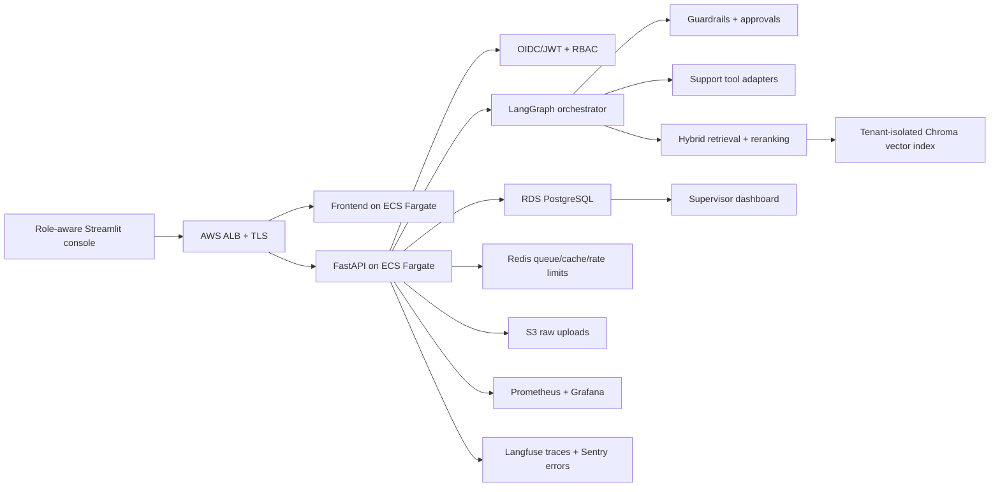
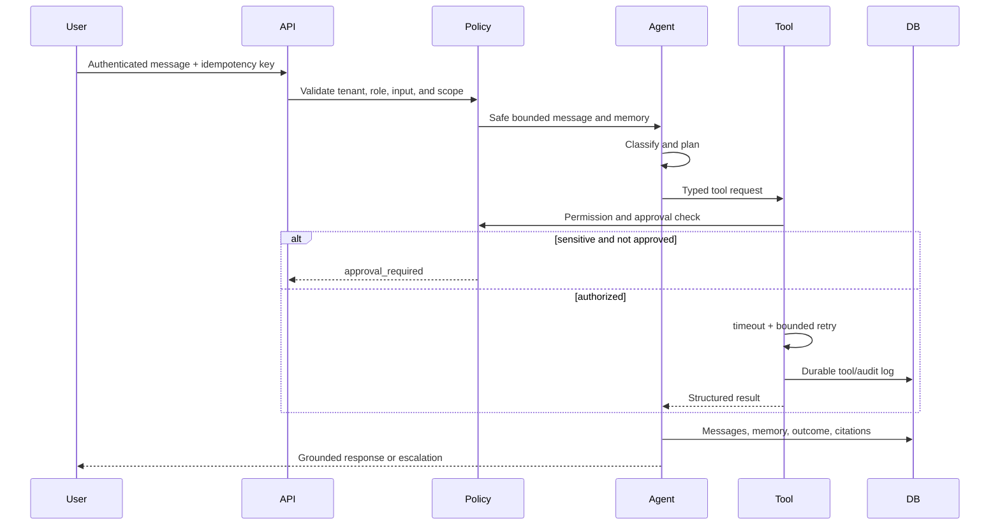
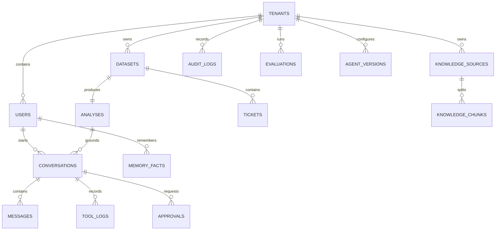

# Production architecture

## Request sequence

## Data and API contracts

- The authoritative schema is in `supportsense/db_models.py`.
- The deployable migration is in `migrations/versions/`.
- Pydantic contracts are in `supportsense/models.py`.
- Interactive OpenAPI documentation is exposed at `/docs`.
- Production endpoints are under `/api/v1`.
- Prometheus metrics are exposed at `/metrics` and should be private.

## Retrieval storage

Ticket and knowledge chunks remain authoritative in PostgreSQL. When
`CHROMA_URL` is configured, ingestion also upserts fixed-dimension embeddings
into a tenant-hashed Chroma collection and a per-analysis or knowledge
namespace. Retrieval fuses keyword rank with Chroma vector rank, then reranks,
checks conflicts, validates citations, and applies a confidence threshold.

The deterministic local embedder requires no model download. Gemini and OpenAI
embedding adapters are selectable through
`SUPPORTSENSE_EMBEDDING_PROVIDER`. If Chroma fails during a request, retrieval
falls back to the in-process scorer; readiness reports the configured vector
dependency as unavailable until it recovers.

SupportSense installs only Chroma's HTTP thin client and explicitly passes
`embedding_function=None` for every collection. All upserts and queries carry
application-generated vectors. Local and CI stacks use Chroma's digest-pinned,
pure-Rust single-node service image. The server remains private and raw
collection-configuration requests are never exposed through the SupportSense
API.

## Database schema

Every customer-data query includes a tenant predicate. Customer conversations
are owner-scoped; customer tickets are requester-scoped; agent tickets are
assignment-scoped; supervisors and admins have tenant-wide operational access.

## Failure behavior

- Provider and tool calls use deadlines and bounded exponential retry.
- Tool and model dependencies use closed/open/half-open circuit breakers.
- Model generation fails over Gemini → Claude (or the reverse) → deterministic
  local generation according to configuration.
- Idempotency conflicts fail with HTTP 409.
- Unknown tools and invalid parameters fail closed.
- Sensitive actions return `approval_required`; they do not execute.
- Tenant misses return 404 to avoid resource enumeration.
- Low-confidence retrieval abstains.
- ECS deployment circuit breakers roll back unhealthy releases.
